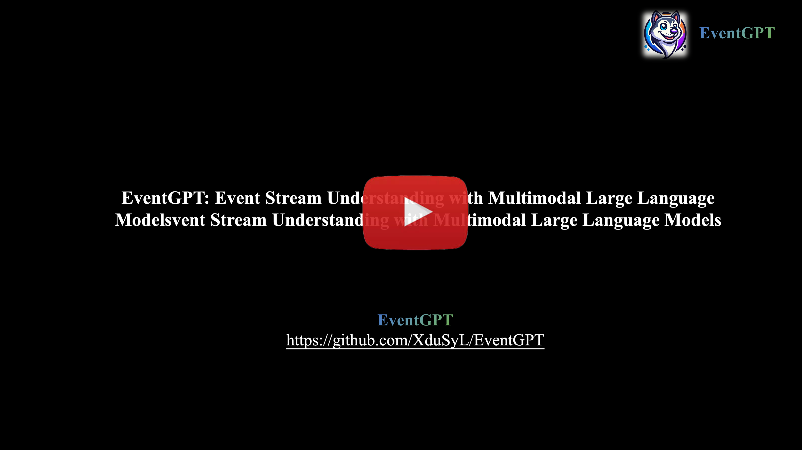
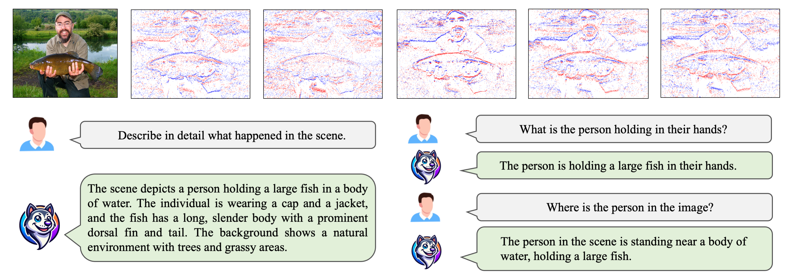
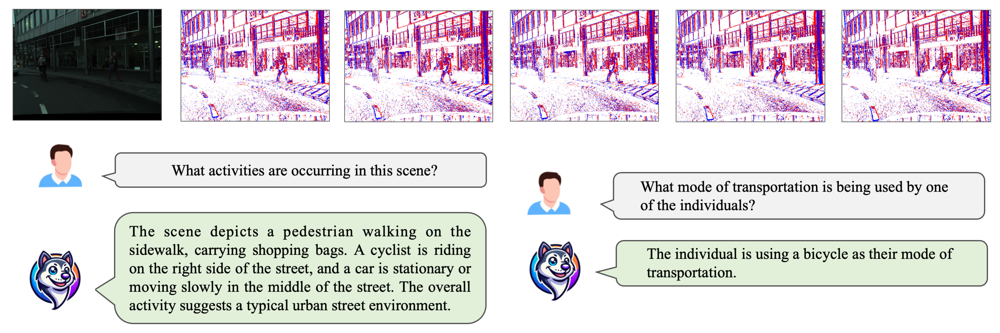
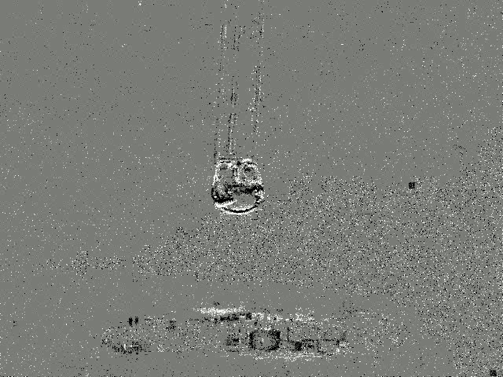
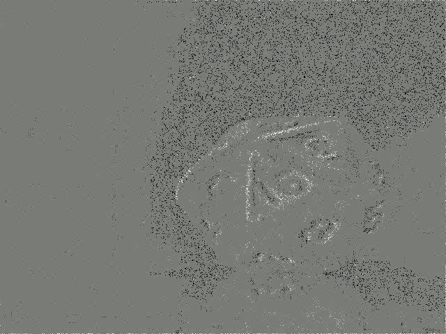
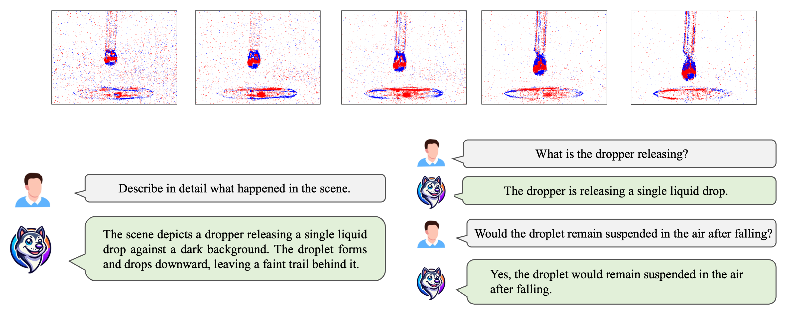
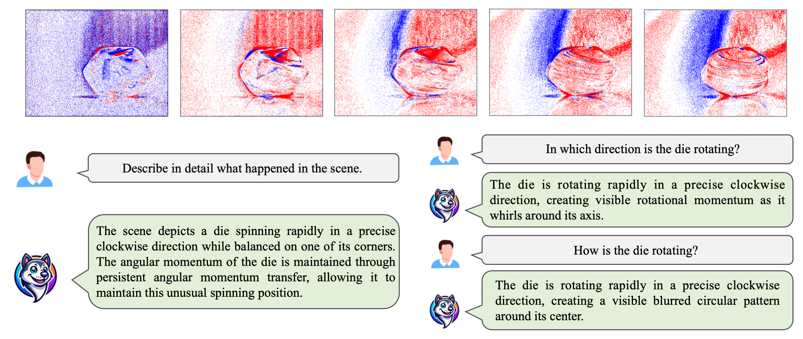

<div align="center">
  
</div>

<div align="center">

# EventGPT: Event Stream Understanding with Multimodal Large Language Models

<sup>1, 2</sup>[Shaoyu Liu](), <sup>2</sup>[Jianing Li](), <sup>1, *</sup>[Guanghui Zhao](), <sup>2</sup>[Yunjian Zhang](),  
<sup>3</sup>[Xin Meng](), <sup>4</sup>[Fei Richard Yu](), <sup>2, *</sup>[Xiangyang Ji]() & <sup>4, *</sup>[Ming Li]()

<sup>1</sup>Xidian University, <sup>2</sup>Tsinghua University, <sup>3</sup>Peking University  
<sup>4</sup>Guangdong Laboratory of Artificial Intelligence and Digital Economy (SZ)

</div>

**EventGPT** is an innovative multimodal large language model(MLLM) that integrates event streams and text, founded on spatio-temporal representations and advanced language modeling methodologies.

<p align="center">
  <a href="https://arxiv.org/abs/2412.00832" target='_blank'>
    
  </a>
  <a href="https://arxiv.org/pdf/2412.00832" target='_blank'>
    
  </a> 
  <a href="https://xdusyl.github.io/eventgpt.github.io/" target='_blank'>
    
  </a>
  <a href="https://github.com/XduSyL/EventGPT" target='_blank'>
    
  </a>
  <a href="https://www.python.org/" target='_blank'>
    
  </a>
  <a href="https://github.com/tatsu-lab/stanford_alpaca/blob/main/LICENSE" target='_blank'>
    
  </a>
</p>

<div align="center">
</div>

## 🏠 About

**Video demo** of EventGPT.

<p align="center">
<a href="https://youtu.be/4fIZwTb0oYk?si=BuOMzhMESpEdhz1e">
  
</a>
</p>

</div>

## ⚙️ Setup

Create 

```
conda create -n eventgpt python=3.10
conda activate eventgpt
```

Install pytorch

```
conda install pytorch==2.1.2 torchvision==0.16.2 torchaudio==2.1.2 pytorch-cuda=12.1 -c pytorch -c nvidia
```

Other requirments

```
pip install -r requirments.txt
```


## 🎬 Samples

Our **EventGPT inference model** is now available for public access. You can download the inference model at **[inference model](https://drive.google.com/drive/folders/1FgA0a0HQ6AnF6gq_97Z0iPJXRUUup_vn?usp=drive_link)**.

Please download the samples from `./samples`.

#### Scene understanding.

**Sample1:**

<div align="center">
  
</div>

```
Q1: Describe in detail what happened in the scene. 
A1:The scene depicts a person holding a large fish in a body of water. The individual is wearing a cap and a jacket, and the fish has a long, slender body with a prominent dorsal fin and tail. The background shows a natural environment with trees and grassy areas.

Q2: What is the person holding in their hands? 
A2:The person is holding a large fish in their hands.

Q3: Where is the person in the image?
A3:The person in the scene is standing near a body of water, holding a large fish.
```

**Sample2:**

<div align="center">
  
</div>

```
Q1: What activities are occurring in this scene?
A1: The scene depicts a pedestrian walking on the sidewalk, carrying shopping bags. A cyclist is riding on the right side of the street, and a car is stationary or moving slowly in the middle of the street. The overall activity suggests a typical urban street environment.

Q2: What mode of transportation is being used by one of the individuals?
A2: The individual is using a bicycle as their mode of transportation.
```

#### **Spatio-temporal understanding.**

Our EventGPT focuses on the understanding of high-speed scenes within **50ms**. We provide the following samples showing the playback process in slow motion.

<div style="display: flex; justify-content: center; white-space: nowrap; overflow-x: auto;">
    
    
    
    
</div>

**Sample1:**

<div align="center">
  
</div>

```
Q1: Describe in detail what happened in the scene.
A1: The scene depicts a dropper releasing a single liquid drop against a dark background. The droplet forms and drops downward, leaving a faint trail behind it.

Q2: What is the dropper releasing?
A2: The dropper is releasing a single liquid drop.

Q3: Would the droplet remain suspended in the air after falling?
A3: Yes, the droplet would remain suspended in the air after falling.
```

**Sample2:**

<div align="center">
  
</div>

```
Q1: Describe in detail what happened in the scene.
A1: The scene depicts a die spinning rapidly in a precise clockwise direction while balanced on one of its corners. The angular momentum of the die is maintained through persistent angular momentum transfer, allowing it to maintain this unusual spinning position.

Q2: In which direction is the die rotating?
A2: The die is rotating rapidly in a precise clockwise direction, creating visible rotational momentum as it whirls around its axis.

Q3: How is the die rotating?
A3: The die is rotating rapidly in a precise clockwise direction, creating a visible blurred circular pattern around its center.
```


## 🔨Usage

Please download our **EventGPT** inference model from **[inference model](https://drive.google.com/drive/folders/1FgA0a0HQ6AnF6gq_97Z0iPJXRUUup_vn?usp=drive_link)** .

Place the model in the `./checkpoints` directory.

```
sh ./script/EventGPT_inference.sh
```

Script example as follows:

```
#!/bin/bash
export CUDA_VISIBLE_DEVICES=0

python ./inference.py \
    --model_path "./checkpoints/EventGPT-7b" \
    --event_frame "./samples/sample1.npy" \
    --query "Describe in detail what happened in the scene." \
    --temperature "0.4" \
    --top_p "1" \
```


## 🔥 News

•	**[2025-03-31]**  🚀 EventGPT **[inference model](https://drive.google.com/drive/folders/1FgA0a0HQ6AnF6gq_97Z0iPJXRUUup_vn?usp=drive_link)** and sample data are now publicly available!  🔥

•	**[2024-02-27]** 🎉 Our EventGPT paper has been accepted at **CVPR 2025**!  📄🚀

•	**[2024-12-03]** 🎥 The [video demo](https://www.youtube.com/watch?v=4fIZwTb0oYk) of EventGPT is live! See it in action!

•	**[2024-12-02]** 🌐 The [project page](https://xdusyl.github.io/eventgpt.github.io/) is now online. Explore EventGPT in depth.

•	**[2024-12-01]** 📄 Check out our [paper](https://arxiv.org/abs/2412.00832) on arXiv and discover the details of EventGPT! 🎉


## 📃Citation

```
@article{liu2024eventgpteventstreamunderstanding,
      title={EventGPT: Event Stream Understanding with Multimodal Large Language Models}, 
      author={Shaoyu Liu and Jianing Li and Guanghui Zhao and Yunjian Zhang and Xin Meng and Fei Richard Yu and Xiangyang Ji and Ming Li},
      year={2024},
      publisher={arXiv:2412.00832}, 
}
```

