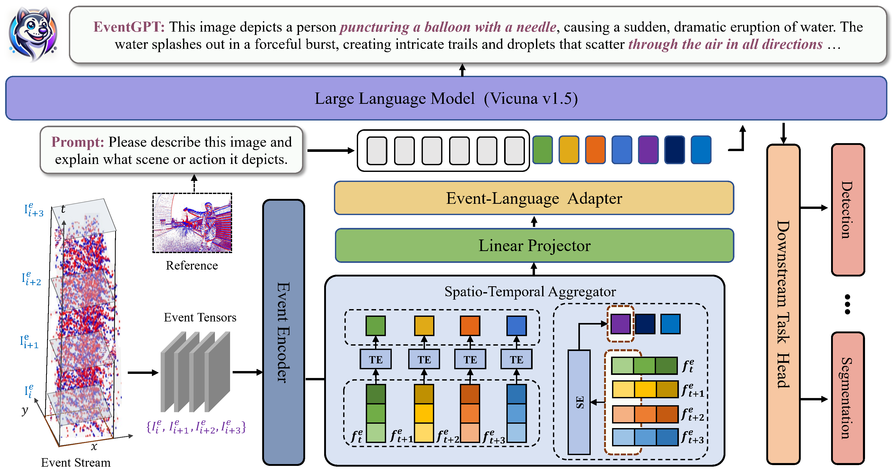

# EventGPT: Event Stream Understanding with Multimodal Large Language Models

<!-- **Authors:** -->

1[Shaoyu Liu](), 2[Jianing Li](), 1[Guanghui Zhao](), 3[Yunjian Zhang](),

4[Xin Meng](), 5[Fei Richard Yu](), 2[Xiangyang Ji](), 5[Ming Li]()

<!-- **Affiliations:** -->

1Xidian University, 2Tsinghua University, 3UCAS, 4Peking University

5Guangdong Laboratory of Artificial Intelligence and Digital Economy(SZ)

**[📰 Project Page](https://xdusyl.github.io/eventgpt.github.io/)**                **[📑arXiv Paper](https://arxiv.org/abs/2412.00832)**

  

The **EventGPT** model, along with the **N-ImageNet-Chat** and **Event-Chat** datasets, will be released after the acceptance of our paper
